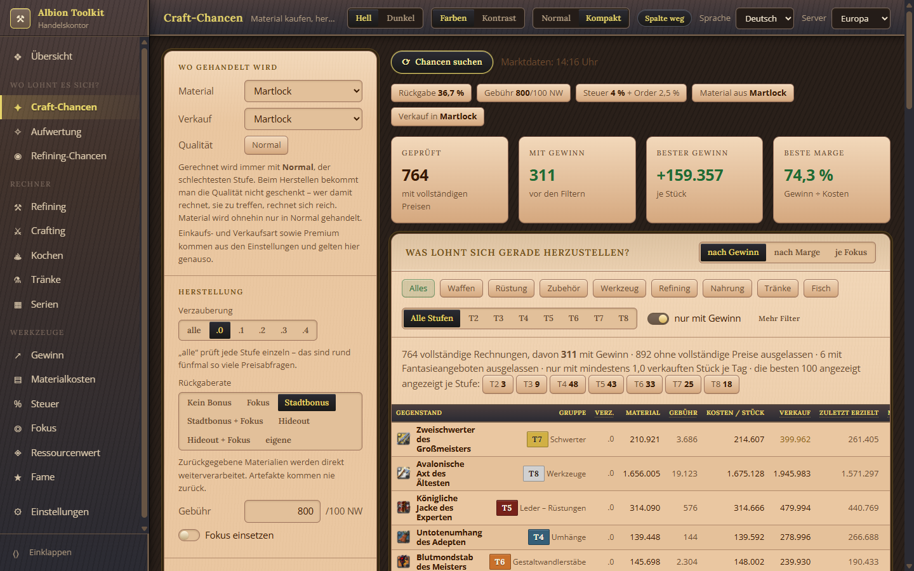
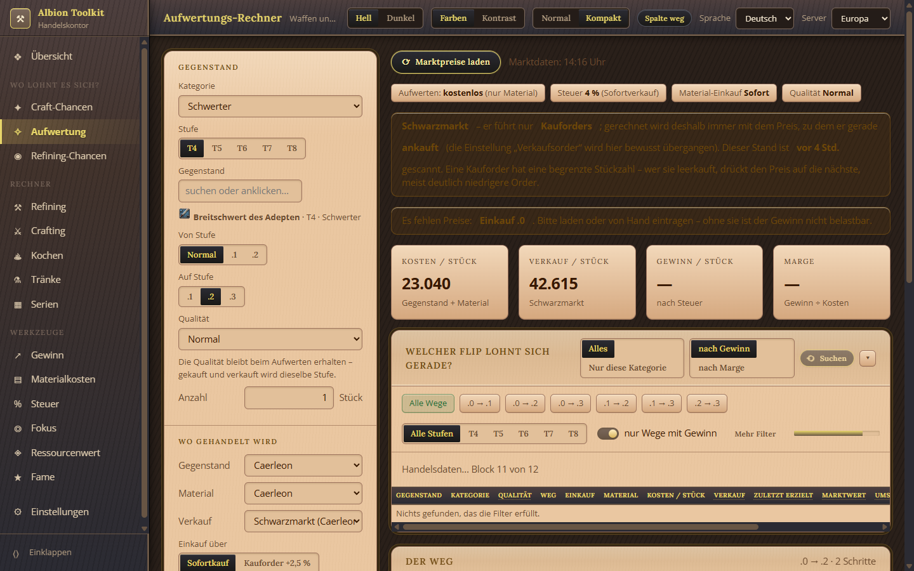
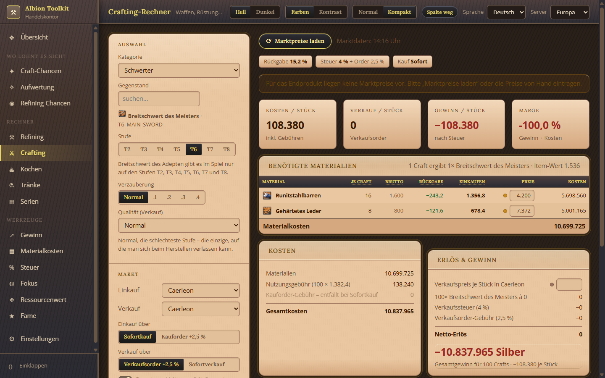
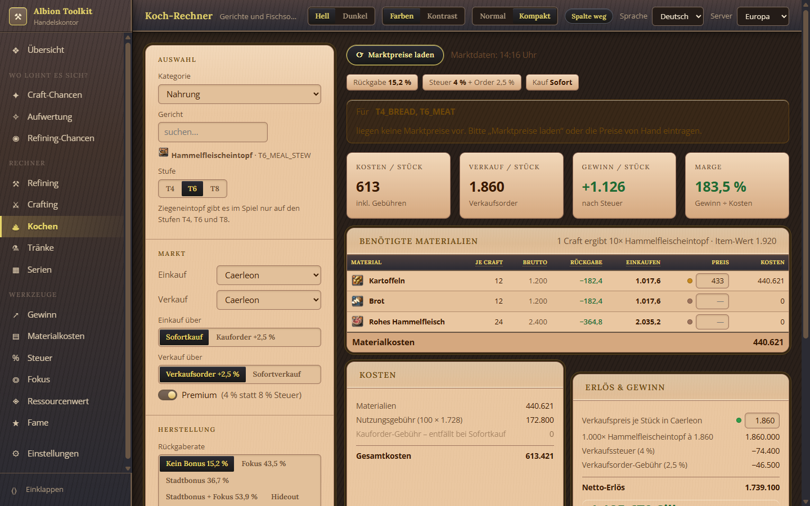
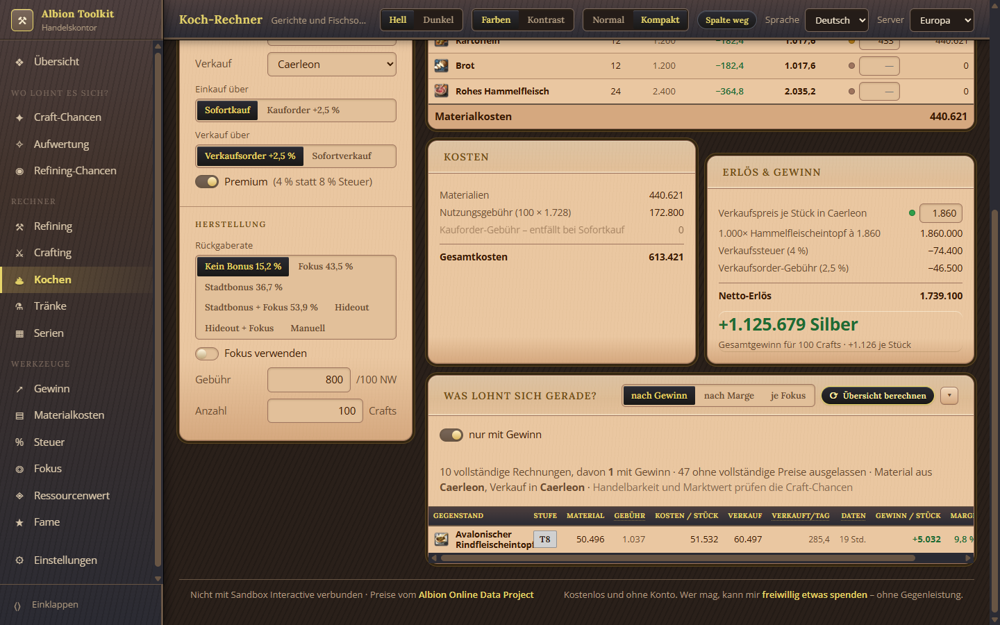
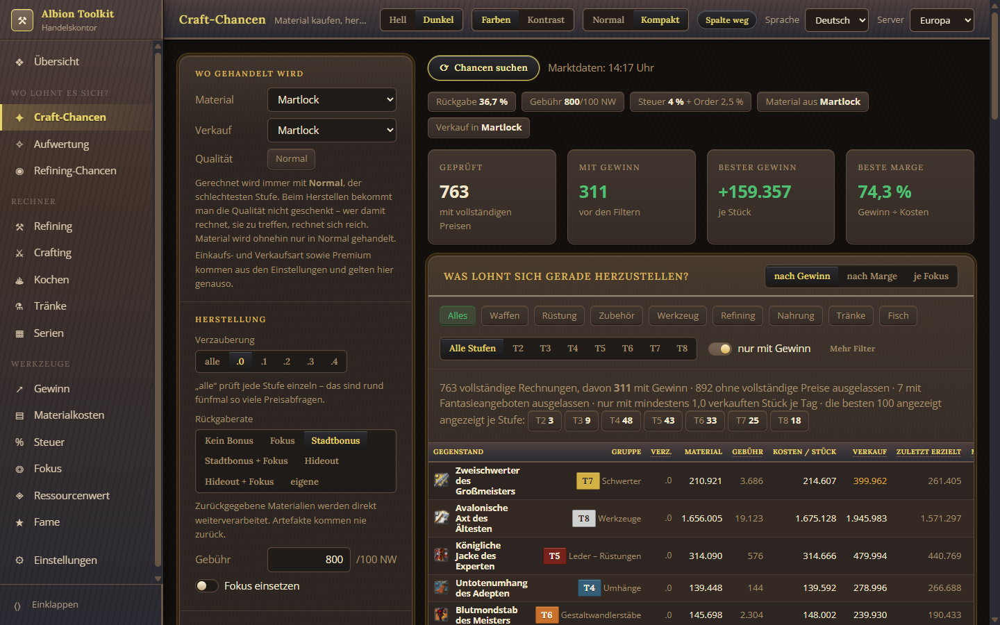
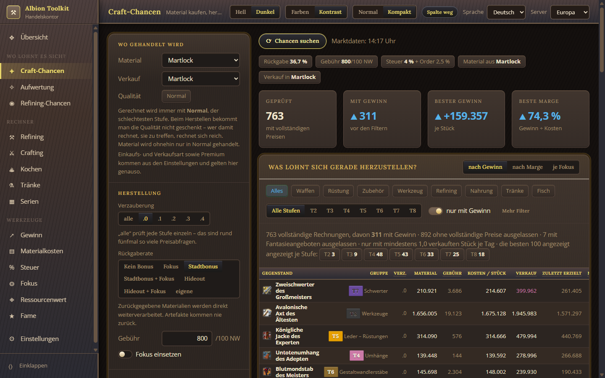
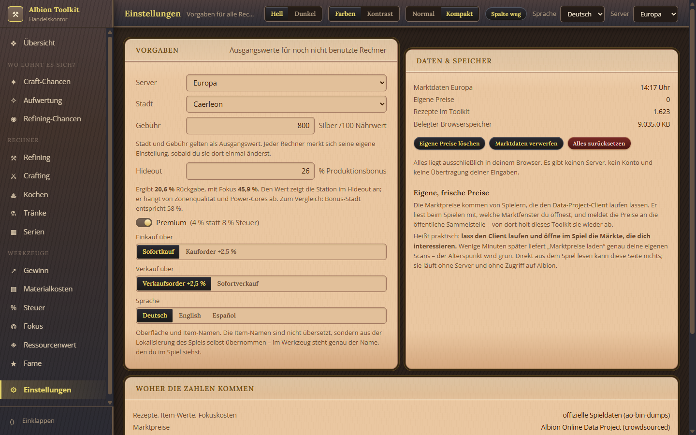

# Albion Economy Toolkit

**Sieh auf einen Blick, womit sich in Albion Online gerade Silber verdienen
lässt.** Herstellen, Aufwerten, Raffinieren, Kochen – mit echten Rezepten aus
den Spieldaten und echten Marktpreisen.

Läuft komplett auf deinem Rechner. **Kein Server, kein Konto, keine
Anmeldung.** Entweder als Windows-Programm oder einfach, indem du eine
HTML-Datei doppelklickst.



---

## Inhalt

- [Was es kann](#was-es-kann)
- [Installieren](#installieren)
- [Die ersten fünf Minuten](#die-ersten-fünf-minuten)
- [Woher die Zahlen kommen](#woher-die-zahlen-kommen)
- [Häufige Fragen](#häufige-fragen)
- [Für Entwickler](#für-entwickler)

---

## Was es kann

### Craft-Chancen: alles Herstellbare auf einen Blick

Prüft **jeden herstellbaren Gegenstand** – Ausrüstung, raffinierte Rohstoffe,
Nahrung, Tränke – gegen die aktuellen Marktpreise und sortiert nach Gewinn,
Marge oder Silber je Fokuspunkt. Rückgaberate, Stationsgebühr, Steuer und
Ordergebühr sind eingerechnet.

Ein Klick auf eine Zeile öffnet den Einzelrechner mit genau diesem Gegenstand.


### Aufwertung: Runen, Seelen und Relikte

Sucht über **alle aufwertbaren Gegenstände in jeder Stufe und jedem Weg**
(.0 → .1 bis .2 → .3), was sich lohnt. Aufwerten kostet kein Silber und keine
Nutzungsgebühr – nur das Material. Steuern und Ordergebühren fallen wie üblich an.



### Einzelrechner für jeden Fall

Crafting, Refining, Kochen, Tränke, Serien, Gewinn, Materialkosten, Steuer,
Fokus, Ressourcenwert, Fame – sechzehn Ansichten, alle mit denselben
Einstellungen für Stadt, Gebühr, Steuer und Premium.



### Koch-Rechner samt Gewinnübersicht

Jedes Gericht mit Zutatenliste, Rückgabe und Nutzungsgebühr. Darunter eine
Übersicht, die eine ganze Kategorie durchrechnet – damit man sofort sieht,
was sich überhaupt lohnt.





### Dunkle Fassung



### Farben für Rot-Grün-Schwäche

Der Schalter **Kontrast** ersetzt Rot und Grün durch Blau und Zinnober und
stellt Gewinn und Verlust zusätzlich ein Dreieck voran – Vorzeichen sind dann
auch ohne Farbe erkennbar.



### Drei Sprachen

Deutsch, Englisch, Spanisch. Die Item-Namen sind dabei **nicht übersetzt**,
sondern aus der Lokalisierung des Spiels selbst übernommen – im Werkzeug steht
genau der Name, den du auch im Spiel siehst.



---

## Installieren

Drei Wege. **Weg 2 braucht überhaupt keine Installation.**

### Weg 1: Windows-Programm (empfohlen)

1. Auf der Seite [**Releases**](https://github.com/envious9494-bit/albiononlinecraftingtool/releases/latest)
   die Datei `AlbionToolkit-Setup-1.0.0.exe` herunterladen.
2. Doppelklicken.
3. **Windows meldet sich mit einem blauen Fenster:** „Der Computer wurde durch
   Windows geschützt". Das ist normal – die Datei ist nicht signiert, weil eine
   Signatur mehrere hundert Euro im Jahr kostet.
   Klicke auf **„Weitere Informationen"** und dann auf **„Trotzdem ausführen"**.
4. Das Programm landet im Startmenü und als Verknüpfung auf dem Desktop.

Es installiert nur für deinen Benutzer, braucht also **keine
Administratorrechte**.

> Wer die Warnung lieber ganz vermeiden möchte, nimmt Weg 2 – dort wird nichts
> ausgeführt, sondern nur eine Seite im Browser geöffnet.

### Weg 2: Nur die HTML-Datei öffnen

Ganz ohne Installation, funktioniert auf jedem Betriebssystem:

1. Oben auf der Projektseite auf **Code → Download ZIP** klicken.
2. Das ZIP entpacken.
3. **`index.html` doppelklicken.**

Das war alles. Die Seite öffnet sich im Browser und kann sofort alles.

Warum das geht: Das Toolkit ist reines HTML, CSS und JavaScript ohne
Bauschritt. Die Spieldaten liegen als fertige `.js`-Dateien daneben, die
Marktpreise holt die Seite direkt vom Albion Online Data Project.

### Weg 3: Portable Fassung

Auf der Seite [Releases](https://github.com/envious9494-bit/albiononlinecraftingtool/releases/latest)
liegt zusätzlich `AlbionToolkit-1.0.0.zip`. Entpacken, `Albion Toolkit.exe`
starten – nichts wird installiert, alles bleibt im Ordner. Praktisch für einen
USB-Stick.

---

## Die ersten fünf Minuten

1. **Marktpreise laden.** In jeder Ansicht gibt es dafür einen Knopf. Preise
   werden nie von selbst geladen – nur auf Knopfdruck.
2. **Server einstellen.** Oben rechts: Europa, Amerika oder Asien. Falscher
   Server heißt falsche Preise.
3. **Stadt wählen.** Wo kaufst du dein Material, wo verkaufst du das Ergebnis?
4. **Rückgaberate setzen.** Kein Bonus 15,2 % · Fokus 43,5 % · Stadtbonus
   36,7 % · Stadtbonus + Fokus 53,9 %. Für ein Hideout gibst du den Wert ein,
   den dir die Station dort anzeigt.
5. **Craft-Chancen öffnen** und suchen lassen.

### Zwei Dinge, die man wissen sollte

**Gerechnet wird immer mit Normal**, der schlechtesten Qualität. Beim
Herstellen bekommt man die Qualität nicht geschenkt – wer damit rechnet, sie zu
treffen, rechnet sich reich.

**Preise sind nur so gut wie ihr letzter Scan.** Wenn niemand den Markt in
deiner Stadt geöffnet hat, sind die Daten alt. Das Toolkit zeigt zu jedem
Preis sein Alter an und wirft zu alte Zeilen von selbst heraus.

---

## Woher die Zahlen kommen

| | |
|---|---|
| Rezepte, Item-Werte, Fokuskosten | offizielle Spieldaten (`ao-bin-dumps`) |
| Item-Namen in drei Sprachen | Lokalisierung des Spielclients |
| Marktpreise und Handelsmengen | [Albion Online Data Project](https://www.albion-online-data.com/) |
| Item-Bilder | Albion Online Render Service |

Die Marktpreise stammen von Spielern, die den **Data-Project-Client**
mitlaufen lassen. Er liest beim Spielen mit, welche Marktfenster du öffnest,
und meldet die Preise an die öffentliche Sammelstelle. Wer selbst frische
Preise für seine Stadt will, lässt ihn nebenher laufen und öffnet im Spiel die
Märkte, die ihn interessieren.

Diese Seite kann **nichts direkt aus dem Spiel lesen**. Sie läuft ohne Server
und ohne Zugriff auf Albion.

**1.530** Ausrüstungsrezepte, **93** Gerichte und Tränke, **1.207**
Materialien mit Item-Werten.

---

## Häufige Fragen

**Ist das erlaubt?**
Ja. Das Toolkit greift nicht ins Spiel ein und liest nichts aus dem Spiel aus.
Es rechnet mit öffentlich verfügbaren Daten. Der Data-Project-Client ist von
Sandbox Interactive ausdrücklich geduldet.

**Werden meine Daten irgendwohin geschickt?**
Nein. Alles liegt in deinem Browser (bzw. im Programm). Es gibt keinen Server,
kein Konto und keine Übertragung deiner Eingaben. Die einzige Verbindung nach
außen holt Marktpreise ab – und zwar erst, wenn du auf den Knopf drückst.

**Warum sind manche Felder leer?**
Weil für diesen Gegenstand in dieser Stadt niemand kürzlich den Markt geöffnet
hat. Du kannst den Preis von Hand eintragen – gold umrandete Felder sind
deine eigenen und überschreiben den Marktwert.

**Warum weicht der Gewinn von dem ab, was ich im Spiel sehe?**
Prüf drei Dinge: den Server oben rechts, das Alter der Preise, und ob deine
Rückgaberate stimmt. Der häufigste Fehler ist eine veraltete Preisangabe in
einer Stadt, die selten gescannt wird.

**Ich bin farbenblind / kann das schlecht lesen.**
Oben in der Kopfzeile: **Dunkel** für die dunkle Fassung, **Kontrast** für
Farben, die bei Rot-Grün-Schwäche unterscheidbar bleiben, **Normal/Kompakt**
für die Schriftgröße.

---

## Für Entwickler

Ausführliche technische Dokumentation – jede Formel mit Quelle und Nachrechnung –
steht in **[docs/TECHNIK.md](docs/TECHNIK.md)**.

```
index.html          alles beginnt hier
css/                Gestaltung, Farben als Variablen
js/core/            Markt, Rechenkern, Router, Sprache
js/views/           die sechzehn Ansichten
data/               Spieldaten als fertige .js-Dateien
electron/           Fenster für die Windows-Fassung
tools/bilder.js     nimmt die Bildschirmfotos oben auf
```

Der Rechner selbst braucht **keinen Bauschritt**: klassische `<script>`-Tags,
keine Module, keine Abhängigkeiten. `npm` wird nur gebraucht, um das
Windows-Programm zu bauen.

```bash
npm install
npm start      # im Electron-Fenster starten
npm run dist   # Installer und ZIP nach dist/ bauen
npm run bilder # Bildschirmfotos für die README neu aufnehmen
```

---

## Spenden

Das Toolkit ist kostenlos und bleibt es. Wer mag, kann mir
[**freiwillig etwas spenden**](https://www.paypal.com/paypalme/DevEnvi24) –
ohne Gegenleistung.

---

## Lizenz

[MIT](LICENSE) – mach damit, was du willst.

Dieses Werkzeug ist ein privates Projekt und **nicht mit Sandbox Interactive
verbunden**. Albion Online sowie die Item-Namen und -Grafiken gehören Sandbox
Interactive GmbH.
