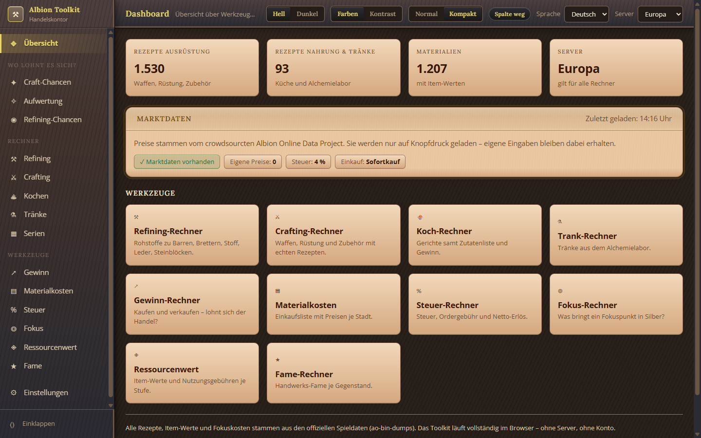

# Albion Economy Toolkit

*[Deutsche Fassung →](README.de.md)*

**See at a glance where the silver is in Albion Online right now.** Crafting,
enchanting, refining, cooking – with real recipes from the game data and real
market prices.

Runs entirely on your own machine. **No server, no account, no sign-up.**
Either as a Windows program, or simply by double-clicking an HTML file.


---

## Contents

- [What it does](#what-it-does)
- [Installing](#installing)
- [The first five minutes](#the-first-five-minutes)
- [Where the numbers come from](#where-the-numbers-come-from)
- [Questions people ask](#questions-people-ask)
- [For developers](#for-developers)

---

## What it does

### Crafting Deals: everything craftable at a glance

Checks **every craftable item** – equipment, refined resources, food, potions –
against current market prices and sorts by profit, margin or silver per focus
point. Return rate, station fee, sales tax and order fee are all included.

Clicking a row opens the single-item calculator with exactly that item loaded.


### Enchanting: runes, souls and relics

Searches **every enchantable item at every tier and on every path** (.0 → .1 up
to .2 → .3) for what is worth doing. Enchanting costs no silver and no station
fee – only the material. Tax and order fees apply as usual.


### A calculator for every case

Crafting, refining, cooking, potions, batches, profit, material costs, tax,
focus, item value, fame – sixteen views, all sharing the same settings for
city, fee, tax and premium. Dishes and potions can also be calculated
enchanted (.1 to .3).

The **refining calculator** shows every tier of a family – leather, say –
side by side, with the cheapest place to buy and the best place to sell. And
because refining is a volume business, you can **sell to your guild** there:
market value minus a discount, with no tax and no order fee.


### Cooking calculator with a profit overview

Every dish with its ingredient list, return rate and station fee. Below it, an
overview that calculates a whole category at once – so you can see immediately
what is even worth cooking.


### Dark theme


### Colours for red-green colour blindness

The **Contrast** switch replaces red and green with blue and vermilion, and
puts a triangle in front of profit and loss – so the sign is readable without
relying on colour at all.


### It tells you when something new is out

The Windows client checks quietly at startup whether a newer version exists and
then asks once: *Download now* · *Later* · *Skip this version*. It only asks –
nothing is downloaded or installed without you. If there is nothing new, or no
network right now, nothing happens at all.

### Three languages

German, English, Spanish. The item names are **not translated** – they are
taken from the game's own localisation, so the tool shows exactly the name you
see in the game.


---

## Installing

Three ways. **Way 2 needs no installation at all.**

### Way 1: Windows program (recommended)

1. Download **[AlbionToolkit-Setup.exe](https://github.com/envious9494-bit/albiononlinecraftingtool/releases/latest/download/AlbionToolkit-Setup.exe)**
   – that link always points at the newest version. All versions are on the
   [Releases](https://github.com/envious9494-bit/albiononlinecraftingtool/releases/latest) page.
2. Double-click it.
3. **Windows will show a blue box:** "Windows protected your PC". This is
   expected – the file is not code-signed, because a signature costs several
   hundred euros a year.
   Click **"More info"**, then **"Run anyway"**.
4. The program appears in the Start menu and as a desktop shortcut.

It installs for your user only, so it needs **no administrator rights**.

> If you would rather avoid the warning entirely, take Way 2 – nothing is
> executed there, a page just opens in your browser.

### Way 2: Just open the HTML file

No installation, works on any operating system:

1. On the project page, click **Code → Download ZIP**.
2. Unpack the ZIP.
3. **Double-click `index.html`.**

That is all. The page opens in your browser and can do everything right away.

Why this works: the toolkit is plain HTML, CSS and JavaScript with no build
step. The game data sits next to it as ready-made `.js` files, and market
prices are fetched straight from the Albion Online Data Project.

### Way 3: Portable version

Download **[AlbionToolkit.zip](https://github.com/envious9494-bit/albiononlinecraftingtool/releases/latest/download/AlbionToolkit.zip)**,
unpack it, run `Albion Toolkit.exe` – nothing is installed, everything stays in
the folder. Handy for a USB stick.

---

## The first five minutes

1. **Load market prices.** Every view has a button for it. Prices are never
   fetched on their own – only when you press it.
2. **Pick your server.** Top right: Europe, Americas or Asia. The wrong server
   means the wrong prices.
3. **Choose your cities.** Where do you buy your material, where do you sell
   the result?
4. **Set the return rate.** No bonus 15.2 % · Focus 43.5 % · City bonus 36.7 %
   · City bonus + focus 53.9 %. For a hideout, enter the value the station
   there shows you.
5. **Open Crafting Deals** and let it search.

The dashboard always shows how old your market data is and which calculators
exist:



### Two things worth knowing

**Everything is calculated at Normal**, the lowest quality. Crafting does not
hand you quality for free – anyone who counts on hitting it is doing wishful
maths.

**A price is only as good as its last scan.** If nobody has opened the market
in your city recently, the data is old. The toolkit shows the age of every
price and drops rows whose data is too old.

---

## Where the numbers come from

| | |
|---|---|
| Recipes, item values, focus costs | official game data (`ao-bin-dumps`) |
| Item names in three languages | the game client's own localisation |
| Market prices and trade volumes | [Albion Online Data Project](https://www.albion-online-data.com/) |
| Item images | Albion Online Render Service |

Market prices come from players who run the **Data Project client**. While
they play, it reads along which market windows they open and reports the
prices to the public collection point. If you want fresh prices for your own
city, run it alongside the game and open the markets you care about.

This page **cannot read anything from the game**. It runs without a server and
without any access to Albion.

**1,530** equipment recipes, **93** dishes and potions, **1,207** materials
with item values.

---

## Questions people ask

**Does this interfere with the game?**
No. This toolkit has no connection to the game whatsoever: it reads nothing,
changes nothing and runs completely separately. It calculates using recipes
from the public game data and prices other players have collected.

The **Data Project client** that collects those prices is a separate program
and not part of this project. Whether you want to run it is your own decision –
its terms are on [albion-online-data.com](https://www.albion-online-data.com/).

**Is any of my data sent anywhere?**
No. Everything stays in your browser (or in the program). There is no server,
no account and no transfer of anything you type. The only outbound connection
fetches market prices – and only once you press the button.

**Why are some fields empty?**
Because nobody has opened the market for that item in that city recently. You
can type the price in by hand – gold-outlined fields are your own and override
the market value.

**Why does the profit differ from what I see in the game?**
Check three things: the server in the top right, the age of the prices, and
whether your return rate is right. The most common cause is a stale price in a
city that rarely gets scanned.

**I am colour blind / I find this hard to read.**
In the header bar: **Dark** for the dark theme, **Contrast** for colours that
stay distinguishable with red-green colour blindness, **Normal/Compact** for
text size.

---

## For developers

Full technical documentation – every formula with its source and a worked
example – is in **[docs/TECHNICAL.md](docs/TECHNICAL.md)**.

```
index.html          everything starts here
css/                styling, colours as custom properties
js/core/            market, calculation core, router, language
js/views/           the sixteen views
data/               game data as ready-made .js files
electron/           window for the Windows version
tools/bilder.js     takes the screenshots above
```

The calculator itself needs **no build step**: classic `<script>` tags, no
modules, no dependencies. `npm` is only needed to build the Windows program.

```bash
npm install
npm start      # run in an Electron window
npm run dist   # build installer and ZIP into dist/
npm run bilder # retake the screenshots for the README
```

---

## Donations

The toolkit is free and stays free. If you feel like it, you can
[**donate voluntarily**](https://www.paypal.com/paypalme/DevEnvi24) – with
nothing in return.

---

## Licence

[MIT](LICENSE) – do what you like with it.

This tool is a private project and **not affiliated with Sandbox Interactive**.
Albion Online, its item names and its graphics belong to Sandbox Interactive
GmbH.
